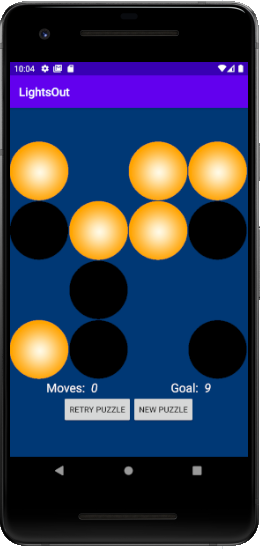
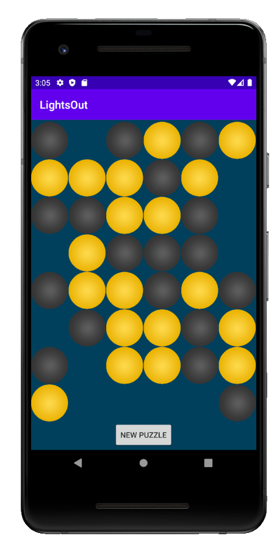

# Description

An Android mobile game based on the [classic puzzle](https://en.wikipedia.org/wiki/Lights_Out_(game)), developed in Java using Android Studio.

The goal of the game is deceptively simple: Turn off all the lights on the board. The challenging twist is that clicking one light will toggle the others, leaving you with a mess of lights. Sometimes there is only one possible solution (there is always at least one!).

## Screenshot

The UI of the game, featuring both an easy and hard game underway. On the UI, there is a move counter, as well as an achievable goal for the user to meet. The user also has an option to reset the board to its starting position, or to create a new puzzle.

 

## How to Play

The app can be installed on [Google Play](https://play.google.com/store/apps/details?id=app.game.lightsout) for Android devices.

To play, choose a difficulty level (Easy for beginners) and simply click on one of the circular icons. The goal is to change all of them to the OFF (dark) position. Clicking one of these icons will also toggle the lights adjacent to it.

If you give up, you can reset the puzzle to its starting position with the **Retry Puzzle** button. A new puzzle can also be generated with the **New Puzzle** button. Remember, every puzzle is guaranteed to be solvable!

## Features

* A graphical user interface to display the ongoing game.

* Keeps track of moves with a challenge number of moves to achieve.

* Easy, Medium, and Hard difficulties, each with a different sized grid, as well as a unique daily puzzle to challenge your friends..

* Ability to create new puzzles as desired (either when giving up or finishing a puzzle) or reset a puzzle to try it again.

* Determines when a game has been won and gives congratulations.

## Planned Features

* Integration with a Firebase database.

* Ability to share games with other users.

## Play!

This game is available for download on Android devices on [Google Play](https://play.google.com/store/apps/details?id=app.game.lightsout)