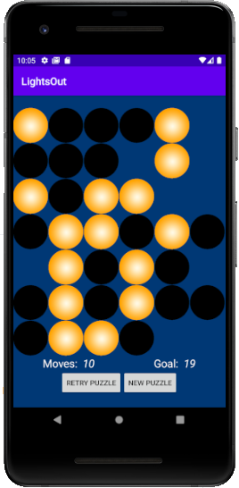

# Lights Out! Mobile Game

A mobile application based on the [classic puzzle](https://en.wikipedia.org/wiki/Lights_Out_(game)), along with a variety of new and challenging changes.

## Screenshot

The UI of the game, featuring both an easy and hard game underway: 

## Introduction

The goal of the game is deceptively simple: Turn off all the lights on the board. The challenging twist is that clicking one light will toggle the others, leaving you with a mess of lights. Sometimes there is only one possible solution (there is always at least one!).

Cells on the board have three possible states: Inactive, which means they aren't a part of the game, Off, which means they've been off (this is good!), and On, which means they're on (this is bad!). The cells are all turned on, then the app deactivates some, then it randomly toggles them, so that there is a guaranteed solution.

I originally made this game as part of an Intro to Computing class in Swing, along with an algorithm that could solve every single game, but now I've revisited it in Android Studio to make it better.

## Features

* A graphical user interface to display the ongoing game.

* Keeps track of moves with a challenge number of moves to achieve.

* Easy, Medium, and Hard difficulties, each with a different sized grid.

* Ability to create new puzzles as desired (either when giving up or finishing a puzzle)

* Determines when a game has been won and gives a congratulations.

## Play!

This game is available for download on Android devices on [Google Play](https://play.google.com/store/apps/details?id=app.game.lightsout)